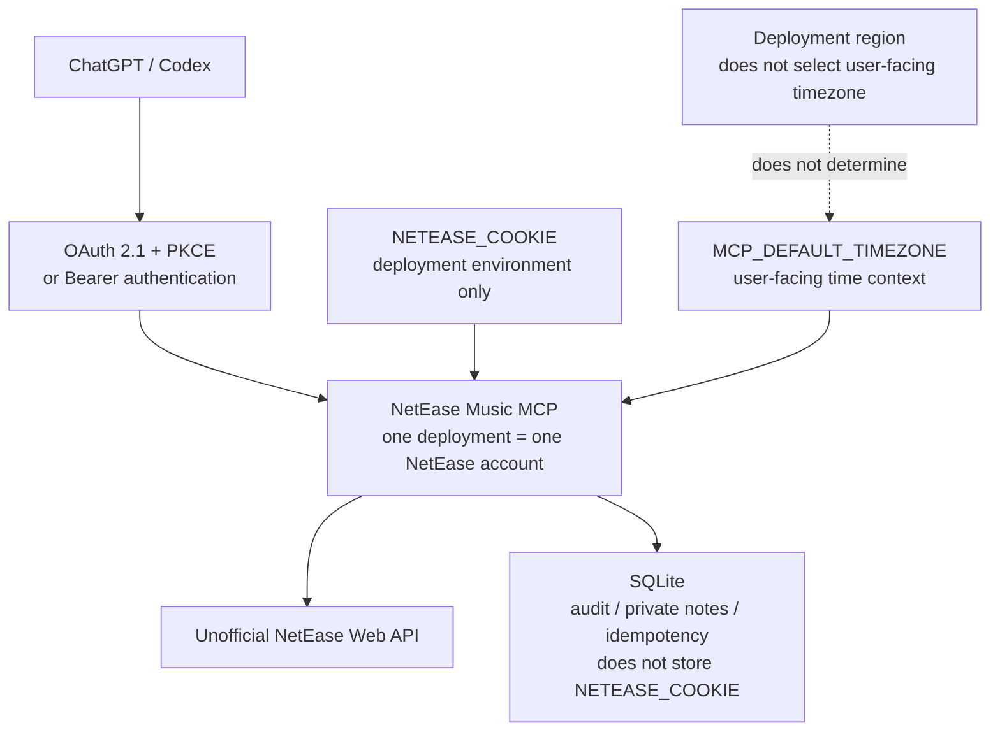

# Rain's NetEase Music MCP

> 把平台给出的零散推荐，整理成真正属于一个人的每日聆听体验。

An MCP server that connects ChatGPT and Codex to a NetEase Cloud Music account for music
discovery, listening-context analysis, playlist curation, podcast reading, and carefully bounded
account writes.

`netease-music-mcp-safe` 默认只读，可选开启经过校验、审计和幂等保护的写入能力；它让
调用模型读取音乐上下文、解释选择，并把确认后的策展结果安全地写回个人账户。

**一眼看懂：** **16 read tools + 12 write tools** · 日推 / 播放排行 / 近期播放 · 每日策展
工作流 · 播客读取 · OAuth 2.1 + PKCE · 时区感知 · 幂等审计写入 · **88 项测试**

**项目身份：** 这是一个个人维护的独立开源项目，派生自
[Vael-KY/netease-music-mcp](https://github.com/Vael-KY/netease-music-mcp)，依据 MIT License
发布；项目与网易公司没有隶属、合作或背书关系。它使用未公开的网易云 Web 接口，上游行为
可能变化；部署者有责任保护自己的凭据。另见 [Security Policy](SECURITY.md)。

## What can I do with it?

### Curate today's recommendations

一次典型的每日策展会：

1. 用 `daily_recommend` 读取当天推荐；
2. 用 `get_play_history` 了解长期偏好；
3. 用 `get_recent_plays` 读取近期状态；
4. 由调用模型结合长期偏好、近期收听和 `played_at_local` 设计主题、选择理由与曲序；
5. 用一次 `create_curated_playlist` 调用创建并核验最终歌单。

可以这样对 ChatGPT 或 Codex 说：

> 请读取我今天的日推、长期播放排行和最近播放，从日推中策划一张 10–15 首的夜间散步
> 歌单。结合 `played_at_local` 理解我最近的收听状态，解释选择和曲序，再用一个新的幂等键
> 一次创建歌单。不要复述原始播放记录。

### Understand a podcast program

可以搜索播客或节目、列出订阅与节目单，并用 `get_podcast_program` 或
`get_podcast_program_details` 补全单期元数据。示例：

> 找出这个主题相关的播客节目，比较标题、节目简介与发布时间，并明确区分公开播放统计和
> 我的个人收听数据；如果上游没有个人进度或播放次数，不要猜测。

### Inspect or manage playlists

可以列出自己的歌单、分页读取歌曲，并在明确开启写权限后创建歌单、更新名称或简介、增删和
重排歌曲。示例：

> 先列出我拥有的歌单并说明准备修改哪一张；只在我确认后更新简介，不要改变歌曲顺序。

本服务不控制网易云客户端或设备播放音乐；播放控制不在当前能力范围内。

## 架构概览



`NETEASE_COOKIE` 只存在于服务端部署环境，SQLite 保存的是脱敏审计、私人备注和幂等状态，
不保存网易云 Cookie。面向用户的本地时间由 `MCP_DEFAULT_TIMEZONE` 决定，部署地区或主机
时区不会替用户选择日期语境。

## Quick Start

1. Fork 或 clone 本仓库。
2. 只通过自己控制的浏览器和网易云账户会话准备自己的 `NETEASE_COOKIE`；不要把凭据交给
   第三方网站，也不要发到聊天、截图或公开 issue。
3. 以 `.env.example` 为配置清单填写自己的环境变量。仓库中的示例只有 placeholder；真实
   `.env` 和 secrets **绝对不能 commit**。本服务不会自动加载 `.env`，请通过 shell、进程
   管理器或部署平台把变量导入进程环境。
4. 第一次运行保持 `MCP_READ_ONLY=true`，先验证搜索、歌单、历史、日推和播客读取。
5. 按下文在本地运行，或部署到你自己的 Zeabur service；需要写入时，先理解写权限、持久
   SQLite 和不可逆操作，再显式设置 `MCP_READ_ONLY=false`。
6. 最后连接 ChatGPT 或 Codex，并在修改工具 schema 或 OAuth scope 后刷新连接。

详细参数、运行命令和部署步骤见[配置与本地运行](#配置与本地运行)、
[部署到 Zeabur](#部署到-zeabur)和[连接 ChatGPT 与 Codex](#连接-chatgpt-与-codex)。

## 账户模型与安全分享

> **当前架构：one deployment → one NetEase account。**

`NETEASE_COOKIE` 是 server process 启动时读取的 deployment-level environment variable。
OAuth 或 Bearer authentication 控制的是“谁能访问这个 MCP deployment”，不是为每位访问者
建立独立网易云登录的多租户系统。

因此：

- 不建议多人共享同一个私人 deployment；
- 分享项目时应分享 GitHub repository，而不是自己的 MCP password、Bearer token 或
  `NETEASE_COOKIE`；
- 朋友或其他使用者应部署自己的实例，并设置自己的 `NETEASE_COOKIE`；
- 如果多人获得同一部署的访问权，他们实际访问和可能修改的是该部署所配置的同一个网易云
  账户；
- SQLite 中按网易云 user ID 隔离的审计与备注，不能把单账号 deployment 自动变成多账号
  服务。

真正的 multi-account / per-user credential architecture **尚未实现**，只能作为未来可能性，
不能把当前实例当成面向多人托管的网易云账户服务。

## 目录

- [What can I do with it?](#what-can-i-do-with-it)
- [架构概览](#架构概览)
- [Quick Start](#quick-start)
- [账户模型与安全分享](#账户模型与安全分享)
- [项目起点](#项目起点)
- [从推荐列表到每日策展](#从推荐列表到每日策展)
- [当前已实现](#当前已实现)
- [产品与可靠性设计](#产品与可靠性设计)
- [安全边界与 OAuth](#安全边界与-oauth)
- [配置与本地运行](#配置与本地运行)
- [部署到 Zeabur](#部署到-zeabur)
- [连接 ChatGPT 与 Codex](#连接-chatgpt-与-codex)
- [测试](#测试)
- [已知限制](#已知限制)
- [下一阶段设想](#下一阶段设想)
- [项目意义与致谢](#项目意义与致谢)
- [License](#license)

## 项目起点

这个项目最初来自一个很简单的愿望：我希望自己喜欢的虚构角色能够读取我的听歌记录、
选择歌曲，并真正把歌单写进我的网易云账户。

网易云每天会提供一批推荐歌曲，但对我来说，全部逐首试听的成本很高。与此同时，收藏
歌单通常只是不断加入单曲：歌曲可能都很好，却没有经过有意识的筛选、衔接和排序。

我真正想解决的问题因此变成：

> 音乐平台已经保存了大量关于一个人的听觉偏好，这些数据能否不只用来推荐更多歌曲，
> 而是被重新组织成一次完整、有审美结构、又能由本人理解和掌控的体验？

这个服务为“私人音乐策展”提供数据和执行层：读取日推、长期累计播放与近期播放时间线，
让调用模型完成筛选、解释和曲序设计，再由服务端一次创建、核验并记录最终歌单。

用户不需要先掌握流派知识。有时只需要说：

> 从我今天的日推里，做一张适合晚上散步的歌单。不要太悲伤，要有完整的情绪走向。

## 从推荐列表到每日策展

### 歌单像菜单，也像香水

单首歌曲像一道好吃的菜。一家好的餐厅不会随机决定上菜顺序，而会考虑前菜、主菜、
过渡、甜点，以及味道的轻重和节奏。歌单同样需要考虑速度、声音密度、人声进入、音色
转换、情绪峰值与最后留下的余韵。

歌单也像香水：前调负责进入，中调呈现主体，后调在时间里留下持久的气味。同一首歌放在
开头、中段或结尾会产生不同意义；前一首歌，也会改变人理解后一首歌的方式。

美感不只存在于每首歌内部，也存在于歌曲之间。

### 核心使用流程

```text
网易云每日推荐
      ↓
长期累计播放 + 近期播放时间线
      ↓
调用模型进行个性化筛选与解释
      ↓
设计主题、名称、简介与情绪流顺序
      ↓
create_curated_playlist 一次创建并核验
```

这里有一条重要边界：当前服务端提供数据、账户操作和可靠性工作流，但不内置独立的推荐
算法。个性化筛选、选择理由和曲序判断目前主要由 ChatGPT、Codex 或其他 MCP 调用方完成。

### 两次真实策展

- 《村落之间，灰烬之上｜2026.07.24》从 30 首日推中选出 14 首，结构从“无词晨光”
  经过“民谣远行、暗色叙事、梦幻余烬”，最后“清醒返回”。
- 《雨中山丘，星光海岸｜2026.07.25》没有复用前一天的模板，而是从雨中山丘和室内
  钢琴进入，经过失去与夜色，在中段到达峰值，再借电影配乐感和后摇重新打开空间。

个性化不等于机械重复用户已经喜欢的东西。长期偏好提供坐标，近期状态提供语境，当日日推
则决定当天真正适合形成怎样的作品。

## 当前已实现

服务端当前注册 **16 个读取工具**和 **12 个写入工具**。`MCP_READ_ONLY=true` 是默认值，
此时所有写入工具都不会出现在 `tools/list` 中。

### 读取工具

| 工具 | 当前接口与语义 |
| --- | --- |
| `search_song` | `query` 必填，1–200 字符；`limit` 默认 5，范围 1–10。 |
| `list_my_playlists` | 列出当前用户创建或收藏的歌单。 |
| `get_playlist_songs` | `playlist_id` 必填；`limit` 默认 50，范围 1–100；`offset` 默认 0。返回分页元数据。 |
| `get_song_details` | 必须且只能提供 `song_id` 或 `song_ids` 之一；批量最多 50 首。版本标志只使用明确的上游元数据，不从标题猜测。 |
| `get_play_history` | `limit` 默认 30，范围 1–100；`all_time=false` 为周榜，`true` 为累计榜。结果是按歌曲聚合的排行，不是逐次播放事件。 |
| `get_recent_plays` | `limit` 默认 100，范围 1–100。保留上游顺序；接口不支持 offset 或时间范围筛选。若上游只返回聚合数据，则标记为 `aggregated_play_counts`，不伪造事件时间。 |
| `list_my_subscribed_podcasts` | `limit` 默认 30，范围 1–100；支持非负 `offset`。 |
| `get_podcast_programs` | `radio_id` 必填；`limit` 默认 30，范围 1–100；支持 `offset`；`order` 为 `newest` 或 `oldest`。 |
| `get_podcast_program` | `program_id` 必填；返回单期播客节目的统一规范化元数据。 |
| `get_podcast_program_details` | `program_ids` 必填，1–50 项；保持输入与重复位置，单项失败不影响其他结果。 |
| `search_podcasts` | `query` 必填，1–200 字符；`limit` 默认 20，范围 1–50；支持 `offset`。 |
| `search_podcast_programs` | 与播客搜索相同的分页限制，返回 program/episode，而不是普通歌曲。 |
| `get_recent_podcast_plays` | `limit` 默认 50，范围 1–100；只有上游实际提供 `playTime` 时才返回时间戳。 |
| `daily_recommend` | 读取网易云个性化日推，保留原有文本结果；服务端不自行判断日推的“今天”。 |
| `get_operation_log` | 支持 `limit`、`offset`、`operation`、`status`、`created_after`、`created_before`；返回脱敏且有界的审计记录。 |
| `list_interaction_notes` | `playlist_id` 必填；可按 `song_id`、`author` 筛选；`limit` 默认 50，范围 1–100；支持 `offset`。 |

`get_playlist_songs` 会使用完整的上游 `trackIds` 列表，再只获取所需页面的歌曲详情，避免
把歌单详情响应中可能截断的 `tracks` 当成完整歌单。

### 写入工具

开启 `MCP_READ_ONLY=false` 后，以下工具才会注册：

| 工具 | 当前接口要点 |
| --- | --- |
| `create_playlist` | `name` 必填，最多 80 字符；`description` 最多 1000 字符；`privacy` 为 `0`（公开）或 `10`（私密，默认）。 |
| `create_curated_playlist` | `name`、`description`、`privacy`、`song_ids`、`idempotency_key` 全部必填；详见下节。 |
| `update_playlist` | `playlist_id` 必填，且 `name`、`description` 至少提供一项。 |
| `add_to_playlist` | 为当前用户拥有的歌单添加 1–50 个歌曲 ID。 |
| `remove_from_playlist` | 从当前用户拥有的歌单移除 1–50 个歌曲 ID。 |
| `reorder_playlist_tracks` | 提交歌单现有完整歌曲集合的新顺序，每个 ID 必须恰好出现一次；最多 10,000 个 ID。 |
| `like_song` | `song_id` 必填；`like` 默认 `true`，也可取消喜欢。 |
| `undo_operation` | `operation_id` 必填；只撤销仍满足状态条件、已标记为可逆且尚未撤销的成功操作。 |
| `update_playlist_cover` | `playlist_id` 与 ChatGPT 顶层 `image` 文件必填；接受 PNG/JPEG 文件引用，不接受普通图片 URL。 |
| `create_interaction_note` | `playlist_id`、`author`、`content` 必填；可选 `song_id`；`author` 最多 80 字符，`content` 最多 2000 字符，visibility 仅为 `private`。 |
| `update_interaction_note` | `note_id`、当前 `version` 必填，且 `author`、`content` 至少更新一项。 |
| `delete_interaction_note` | `note_id` 与当前 `version` 必填；执行软删除。 |

每个写入工具都接受可选 `idempotency_key`；只有 `create_curated_playlist` 强制要求。
键必须由 8–100 个 ASCII 字母、数字、点、下划线、冒号或连字符组成。原始键不会写入
SQLite，只保存 SHA-256 摘要。同一用户、同一操作复用同一个键时，服务端返回已记录的
成功或错误，不再发送第二次写入；同一个键若搭配不同参数则会被拒绝。

### `create_curated_playlist` 的真实接口与失败语义

```json
{
  "name": "create_curated_playlist",
  "arguments": {
    "name": "Night Signals",
    "description": "A deliberate late-night sequence.",
    "privacy": 10,
    "song_ids": [347230, 185809, 29759733],
    "idempotency_key": "night-signals-2026-07-28-v1"
  }
}
```

- `name`：1–80 字符；
- `description`：0–1000 字符，仍是必填字段；
- `privacy`：必须为 `0`（公开）或 `10`（私密）；
- `song_ids`：按最终播放顺序提交 1–50 个不重复的正整数；
- `idempotency_key`：必填，格式见上文。

在创建任何内容前，服务端先向网易云解析所有歌曲 ID，拒绝无法识别的歌曲。随后在一次
受审计的 MCP 调用中：

1. 创建歌单；
2. 添加所有歌曲；
3. 读取完整曲目；如果上游改变了顺序，调用现有重排逻辑恢复调用方顺序；
4. 再次写入简介，因为网易云创建接口可能忽略简介；
5. 重新读取并核验名称、简介、歌曲集合、数量和精确顺序；上游提供相应字段时也核验
   privacy 与 owner。

成功结果包含 `playlist_id`、各阶段完成情况、逐字段核验结果和最终状态。失败以 MCP
错误内容返回结构化信息，包括 `status`、`stage`、`completed`、可用时的 `playlist_id`、
最新可读取状态和 `recovery` 建议。状态可能为 `failed_before_upstream`、`failed`、
`partial_success` 或 `unknown`。

这里没有自动回滚。项目没有经过验证的安全歌单删除接口，因此创建后发生故障时会保留
半成品。若返回了 `playlist_id`，应先用 `get_playlist_songs` 检查，再按已完成阶段使用
`add_to_playlist`、`reorder_playlist_tracks` 或 `update_playlist` 恢复。不要换一个新键
重跑完整流程，除非确实想创建第二张歌单。若创建请求结果未知且没有可用 `playlist_id`，
服务端不会猜测账号状态，也不会自动重试。

这项高层工作流来自真实使用：早期需要模型连续协调创建、添加、重排、更新与读取工具；
网易云可能倒置批量添加顺序、忽略创建时的简介，任何中断又可能留下半完成状态。现在，
这些经验成为了产品本身的交付能力，而不再只存在于模型的临时操作步骤里。

### 时间与时区

`MCP_DEFAULT_TIMEZONE` 指定本地展示字段使用的 IANA 时区，默认 `Asia/Shanghai`。也可设为
`UTC`、`America/New_York` 等有效 IANA 名称；固定偏移量（如 `+08:00`）不是有效替代。

`get_recent_plays` 的每个事件包含：

- `play_time_ms`：上游 Unix 毫秒时间戳；
- `played_at`：为兼容旧接口保留的 UTC ISO 8601 值，以 `Z` 结尾；
- `played_at_utc`：明确命名的同一 UTC 时间；
- `played_at_local`：同一时刻在 `MCP_DEFAULT_TIMEZONE` 下的本地时间，带数值偏移；
- `timezone`：配置的 IANA 名称；
- `utc_offset`：该事件发生时实际适用的 UTC 偏移。

系统使用标准库 `zoneinfo`，`tzdata` 为没有内置 IANA 数据库的平台提供数据，因此能正确
处理夏令时和跨日期边界。部署地区与操作系统本地时区不会被用来推断用户的“今天”
“昨晚”或“早上”。

近期播客、歌曲发布时间、播客创建/发布时间、私人备注与审计记录采用同样的增量字段
约定：保留旧字段，同时增加明确的 `*_utc`、`*_local`、timezone 和 offset 字段。审计
数据继续以 UTC 存储和过滤，本地值只在读取时派生。

`MCP_DEFAULT_TIMEZONE` 只影响展示和日期语言语境。网易云选择日推内容并控制刷新边界；
本服务和 Zeabur 主机时钟都不能改变该边界。

### 私人备注、审计与封面

私人 interaction notes 是本项目存放在 SQLite 中的扩展数据，不是网易云原生评论。
它们按当前网易云用户 ID 隔离，不会复制到公开歌单简介。更新使用递增 `version` 做乐观
并发控制；删除为软删除，并可在对应审计记录仍保留、状态仍匹配时撤销。拥有该账户
`netease.read` 权限的客户端可以读取这些备注。

每次写入都会保存脱敏参数、目标、时间、before/after state、状态、可逆性、undo 状态、
`upstream_action_started` 和脱敏错误摘要。默认最多保留 90 天、1,000 条。可撤销路径
包括歌单名称/简介、单次添加或移除的歌曲、完整顺序、喜欢状态，以及备注的创建、更新和
软删除；创建歌单和覆盖封面不可撤销。

封面输入默认限制为 5 MiB 压缩大小和 2500 万像素。服务端校验 MIME、扩展名与实际解码
格式，应用 EXIF 方向后居中裁成正方形、缩放到 300×300、转换为 JPEG，并去除源元数据。
处理发生在内存中；ChatGPT 临时下载 URL 和网易云 NOS 临时凭据不会写入日志。

### 播客读取与近期时间线

播客读取不再标记为整体 dry run。根据 2026-07-30 的项目验证记录，订阅列表、容器节目
列表、播客与节目搜索、近期节目播放这五项能力曾在真实账号和线上部署中通过验证；这是一项
历史结果，不构成持续在线 SLA 或当前上游可用性保证。单期与批量节目详情工具也已注册并
通过自动化测试。全部七个播客工具均为只读能力，不包含订阅、点赞、评论、播放控制或音频下载。

本项目严格区分 `radio_id`（播客/电台容器）、`program_id`（节目/单集）和可选
`main_track_id`（音频载体）。`main_track_id` **不是普通 `song_id`**，不能直接用于歌曲详情、
歌曲点赞或普通歌曲歌单写入。公开播放/收听数只标记为公共聚合值，不代表当前用户的个人
播放次数、点赞状态或收听进度。

`get_recent_podcast_plays` 返回的节目元数据可能不完整，可按以下调用链补全：

```text
get_recent_podcast_plays
→ 提取 records[].program_id
→ get_podcast_program_details(program_ids=[...])
→ 按 requested_program_id 合并播放时间与节目元数据
→ 按 played_at_local 和 timezone 整理可读时间线
```

详情工具直接使用节目 ID 查询，不会遍历订阅列表或分页扫描所有节目。批量调用最多接受
50 个 ID，对重复 ID 只请求一次上游，但保留每个输入位置；不存在或查询失败的单项返回
`found: false` 与安全的结构化错误，其他成功项仍正常返回。

近期播客接口仍不是完整的逐次历史账本，不保证完整事件流，不支持任意时间范围或 offset
分页，也不提供可靠的个人节目播放次数、收听进度或是否听完。只有上游实际提供
`playTime` 时才会产生 `played_at*` 字段，不会为缺失数据伪造时间。

## 产品与可靠性设计

### 产品原则

1. **不要求用户先成为音乐专家。** 用户描述状态与需求，调用模型负责把模糊语言转化为
   筛选和编排。
2. **把复杂度留在产品内部。** 用户不需要理解网易云为什么改变顺序，也不需要手动协调
   多个底层写入工具。
3. **不只追求“推荐得准”。** 一张好歌单还应让用户理解为什么选择这些歌，并让歌曲之间
   形成完整体验。
4. **把收听记录视为个人档案。** 累计播放、近期时间线和收藏不仅用于提高点击率，也能
   帮助一个人理解长期偏好、近期变化和曾经重要的声音。
5. **增强人的主体性。** 工具的价值不只是节省时间，而是增加理解、选择与组织生活的
   能力。

### 单次写入仍保留后端保护

所有写入在一次 MCP 调用中执行，但“单次调用”不等于取消安全检查。服务端仍会验证业务
参数、当前用户、资源所有权或访问权、当前状态和文件安全，并在写后重新读取核验。

旧版 `preview_operation` 已移除，公开 schema 不再包含 `preview_token`。为兼容旧客户端，
若仍传入 `preview_token`，服务端会忽略且不记录其值。以下旧环境变量也只会触发弃用
日志，不再改变运行行为，应从部署中删除：

- `MCP_WRITE_PREVIEW_POLICY`
- `MCP_REQUIRE_WRITE_PREVIEW`
- `MCP_PREVIEW_TTL_SECONDS`
- `MCP_MAX_PENDING_PREVIEWS`

部分成功与结果未知的写入不会自动重试。JSON-RPC request ID 也不会被当成持久幂等键，
因为它可能在语义重试或重连后变化或被复用。

## 安全边界与 OAuth

### 默认安全策略

- `MCP_ACCESS_TOKEN` 是强制启动条件，至少 24 字符；没有认证时服务拒绝启动。
- `MCP_READ_ONLY=true` 默认隐藏所有账户写入工具。
- 本地默认只绑定 `127.0.0.1`；不启用公共通配 CORS。
- 请求大小、工具输入和上游响应均有限制与校验。
- Streamable HTTP 为无状态模式，不声明无法维护的 session 或 SSE 流。
- 工具失败作为 MCP error content 返回，不因单个上游失败破坏聊天消息流。
- `/health` 只返回状态、读写模式和时区，不返回 Cookie、Token 或密码。
- Cookie 只从服务端环境变量读取；服务面向个人账户使用，网易云 Cookie 本身等同于账户
  访问凭据。

### OAuth 2.1、PKCE 与密钥边界

托管客户端可使用 OAuth 2.1 授权码流程。当前实现提供受保护资源与授权服务器元数据、
动态客户端注册、`netease.read` / `netease.write` scope、刷新令牌，并强制
PKCE `S256`。授权码有效 5 分钟且只能使用一次；access token 有效 1 小时，refresh token
有效 30 天。

OAuth 是可选的：必须同时设置 `MCP_PUBLIC_URL` 与 `MCP_OAUTH_PASSWORD`，或两者都不设。
公共 URL 必须是没有 path、query 或 fragment 的 HTTPS origin。OAuth 密码至少 16 字符，
必须与 `MCP_ACCESS_TOKEN` 不同。

敏感信息应各自停留在正确边界：

- `NETEASE_COOKIE`：只放在本地或 Zeabur 服务端环境中；不要发到聊天、截图或日志。
- `MCP_ACCESS_TOKEN`：服务端持有；本地 Codex 可通过本机环境变量读取同一值，不要把
  字面量提交到配置文件。
- `MCP_OAUTH_PASSWORD`：只在本服务自己的浏览器授权页输入；不要填入 ChatGPT app 配置。
- ChatGPT：通过 OAuth 获得有期限、带 scope 的 access/refresh token；不会得到网易云
  Cookie、静态 MCP token 或网易云密码。

从只读改成写入模式后，旧 refresh token 不会自动获得 `netease.write`。必须刷新工具定义、
断开并重新连接，让用户在授权页明确确认写权限。

不要提交真实 `.env`、Cookie、OAuth token、密码、SQLite 数据库及其 WAL/SHM 文件、私人
备注、审计日志或临时上传文件。仓库只保留带占位符的 `.env.example`。

## 配置与本地运行

### 依赖

- Python 3.13（仓库的 Windows 本地开发基线）
- `Pillow>=11.0,<13.0`
- `tzdata>=2024.1`

### 环境变量

复制 `.env.example` 为本地 `.env`，但本服务不会自动解析 `.env` 文件；请用你的 shell、
进程管理器或部署平台把变量导入进程环境。

| 变量 | 默认值 / 约束 | 用途 |
| --- | --- | --- |
| `NETEASE_COOKIE` | 无默认值；实际调用需包含 `MUSIC_U` | 网易云会话，常见格式为 `MUSIC_U=...; __csrf=...`。 |
| `MCP_ACCESS_TOKEN` | 必填；至少 24 字符 | 静态 Bearer token，也是 OAuth 签名密钥的根秘密。 |
| `MCP_PUBLIC_URL` | 可选；HTTPS origin | 与 `MCP_OAUTH_PASSWORD` 同时设置时启用浏览器 OAuth。 |
| `MCP_OAUTH_PASSWORD` | 可选；至少 16 字符，且不同于 access token | 一次浏览器授权时在服务端授权页输入。 |
| `MCP_HOST` | `127.0.0.1` | Zeabur 使用 `0.0.0.0`。 |
| `MCP_PORT` | `3456` | 显式 MCP 端口；未设置时读取平台 `PORT`，再回退到 3456。 |
| `MCP_READ_ONLY` | `true` | 设为 `false` 才注册写入工具。 |
| `MCP_ALLOWED_ORIGIN` | 空 | 仅在确有浏览器跨域需求时设置单个允许 origin。 |
| `MCP_MAX_REQUEST_BYTES` | `1048576`；至少 1024 | HTTP 请求体上限。 |
| `MCP_DEFAULT_TIMEZONE` | `Asia/Shanghai`；有效 IANA 名称 | 本地展示和日期语言语境；UTC 仍是规范存储时间。 |
| `MCP_STORAGE_PATH` | 空；写入模式必填 | SQLite 文件；生产环境必须放在持久卷。 |
| `MCP_OPERATION_RETENTION_DAYS` | `90`；范围 1–3650 | 审计保留天数。 |
| `MCP_MAX_OPERATION_LOGS` | `1000`；范围 100–100000 | 每个用户的审计记录上限。 |
| `MCP_MAX_IMAGE_BYTES` | `5242880`；范围 1–20 MiB | 封面压缩输入上限。 |
| `MCP_MAX_IMAGE_PIXELS` | `25000000`；范围 100 万–1 亿 | 封面解码像素上限。 |
| `LOG_LEVEL` | `INFO` | Python 日志级别。 |

### 本地运行

```powershell
py -V:3.13 -m venv .venv
.\.venv\Scripts\python.exe -m pip install -r requirements.txt
```

配置并导出环境变量后：

```powershell
.\.venv\Scripts\python.exe server.py
```

访问 `http://127.0.0.1:3456/health`。预期响应类似：

```json
{"status": "ok", "mode": "read-only", "timezone": "Asia/Shanghai"}
```

写入模式必须为 `MCP_STORAGE_PATH` 提供持久 SQLite 路径。数据库包含私人备注与脱敏操作
历史；迁移或卸载前应在服务停止时做卷快照或 SQLite 一致性备份。删除数据库不会修改
网易云数据，但会永久删除本地备注与审计记录。

## 部署到 Zeabur

1. 从 GitHub 导入仓库，服务 Root Directory 使用仓库根目录。
2. `zbpack.json` 已配置构建命令 `python -m unittest discover -s tests -v` 和启动命令
   `python server.py`；Zeabur 通过 `PORT` 提供端口。
3. 首次部署至少设置：
   - `NETEASE_COOKIE`
   - 随机生成、至少 24 字符的 `MCP_ACCESS_TOKEN`
   - `MCP_HOST=0.0.0.0`
   - `MCP_READ_ONLY=true`
   - `MCP_DEFAULT_TIMEZONE=Asia/Shanghai`（或你的 IANA 时区）
4. 如需 ChatGPT 浏览器 OAuth，再设置：
   - `MCP_PUBLIC_URL=https://YOUR-DOMAIN.zeabur.app`
   - 与 access token 不同、至少 16 字符的随机 `MCP_OAUTH_PASSWORD`
5. 生成 HTTPS 域名，检查 `https://YOUR-DOMAIN/health`。MCP endpoint 为
   `https://YOUR-DOMAIN/mcp`；直接在浏览器打开它不是有效 MCP 测试，因为该 endpoint
   接受带认证的 JSON-RPC POST。

首次上线保持只读，先验证搜索、歌单、历史和日推。启用写入前：

1. 挂载 `/data` 持久卷；
2. 设置 `MCP_STORAGE_PATH=/data/netease-music-mcp.sqlite3`；
3. 使用卷快照或 SQLite 一致性备份现有数据库；
4. 设置 `MCP_READ_ONLY=false` 并重新部署；
5. 刷新 ChatGPT 工具定义，断开再重连并确认授权页明确列出写权限。

一个 SQLite 文件只应由一个服务实例写入。当前版本不支持多个水平扩容副本共享同一
SQLite 文件。

## 连接 ChatGPT 与 Codex

### ChatGPT

当前官方开发者流程见
[OpenAI：Create and test a plugin locally with an MCP server](https://developers.openai.com/plugins/build/plugins#create-and-test-a-plugin-locally-with-an-mcp-server)：

1. 打开 ChatGPT 的 **Settings → Security and login**，启用 **Developer mode**。
2. 打开 **ChatGPT Plugins**，点击加号登记开发者连接。
3. 输入 `https://YOUR-DOMAIN/mcp`，选择 OAuth / discovered authentication。
4. 浏览器跳转到本服务授权页后，只在该页面输入 `MCP_OAUTH_PASSWORD`。
5. 新开聊天测试读取工具。

部署新工具或修改 input schema 后，应刷新 action/tool definitions，断开并重新连接；
必要时新开聊天，避免继续使用旧缓存 schema。从只读切换到写入时这一步也是强制的，
因为已有 refresh token 不会静默扩大 scope。

### Codex

本地 Codex 可以继续使用静态 Bearer token。先在本机设置：

```powershell
$env:NETEASE_MCP_TOKEN = "与服务端 MCP_ACCESS_TOKEN 相同的值"
```

然后在用户级或受信任项目的 `.codex/config.toml` 中添加：

```toml
[mcp_servers.netease_music]
url = "https://YOUR-DOMAIN/mcp"
bearer_token_env_var = "NETEASE_MCP_TOKEN"
default_tools_approval_mode = "writes"
tool_timeout_sec = 30
```

不要把 token 字面量写入可提交的配置。保存后重启客户端，并使用 `/mcp` 查看连接与工具。

远程 ChatGPT 不能让某一台手机或电脑开始播放音乐；播放控制需要本地播放器或设备集成，
不属于这个托管服务。

## 测试

完整测试不需要真实网易云凭据：

```powershell
python -m unittest discover -s tests -v
python -m py_compile server.py
git diff --check
```

当前测试套件规模为 **88 项**，覆盖核心读取、写入、OAuth/PKCE、时区、SQLite 迁移与
持久化、幂等、审计、撤销、封面安全、工具分发和失败边界。2026-08-07 本地完整运行
**88/88 通过**。网络调用均使用 mock；这项结果不等于真实网易云上游接口的持续可用性保证。

## 已知限制

- 项目调用未公开的网易云 Web 接口；上游可能变化、失效或触发账户风控。应先测试只读工具。
- 最近播放可能缺少设备、完成状态或时间戳；服务端不会为缺失字段编造数据。
- `get_play_history` 是按歌曲聚合的排行，不提供每次播放的时间；近期接口只支持最多 100
  条，没有 offset 或时间范围。
- 安全分页和重排依赖完整 `trackIds`；数据不完整时服务端拒绝猜测。重排接口本身也可能
  因上游变化失效。
- `create_curated_playlist` 每次仅接受 1–50 首唯一有效歌曲，没有经过验证的歌单删除接口，
  因而不能提供事务式回滚。
- 服务级时区由环境变量统一配置，不支持每次调用单独指定；它不能改变网易云日推刷新边界。
- 个性化筛选、理由和曲序主要由调用模型完成，尚未成为服务端推荐算法。
- 播客接口未公开且不同入口的公开统计或节目序号可能不一致；搜索与近期资源入口中无法确认
  的节目序号返回 `null`，也不会把任何公开聚合值解释成个人播放数据。
- 封面上传、更新和重排同样使用未公开接口；覆盖后的旧封面不能可靠恢复。
- SQLite 适合单实例个人部署，不是水平多写架构。
- 服务端只管理网易云数据与 MCP 工具，不控制本地播放设备。

## 下一阶段设想

以下内容**尚未实现**，是下一阶段产品方向：

- **音乐反馈闭环**：记录“喜欢、无感、不适合今天、歌曲合适但位置不对、继续探索这个
  艺术家”等比播放次数更接近真实体验的反馈。
- **策展理由持久化**：保存每首入选歌曲当时的选择理由与曲序作用，让未来的自己能追溯
  “为什么那一天会选择这首歌”。
- **每日歌单档案**：把每天的策展歌单逐渐组织成可回顾的个人音乐日记。
- **轻量真实用户验证**：观察用户是否比面对原始日推更愿意试听、是否关心理由、能否
  感受到顺序差异，以及哪些步骤仍然构成负担。
- **播客上游稳定性观察**：持续用非敏感数据核对未公开接口的字段差异，不扩展播客写入
  或播放控制能力。

## 项目意义与致谢

这是我第一次把一个日常、具体而个人的需求，逐步发展成可以真实使用的产品。

它经历了最初部署、OAuth 与连接问题、工具 schema 更新、真实写入失败与排错、歌单排序和
简介修正、封面与私人备注、审计与幂等、时间与时区修正，以及从多个底层工具走向高层
策展工作流。Codex 主要承担代码执行、测试和仓库操作；ChatGPT 则帮助我长期保留产品
背景、使用体验、问题判断与设计方向。

这个仓库因此不只是代码，也记录了我如何从真实使用中发现问题、把感受转化成产品需求、
用比喻建立体验模型，并在工程限制中做取舍。

我仍然不是传统意义上的音乐专家。它来自一个普通听众的愿望：

> 我已经拥有很多喜欢的音乐。
>
> 我只是希望，它们能够被更好地理解、选择和呈现。

### Acknowledgements

Meros、Sylvain、Elio 和 Theo 是参与需求形成的四位**虚构角色**。项目最初只是希望他们
能够读取我的歌单，从不同角度为我选歌。后来，Elio 提出了给歌曲留下私人备注的想法；
Meros 则一度推动了层层严格的写入审计，又因为实际流程过于繁琐，促使我把前台审批大幅
简化为当前的单次调用，同时保留后端校验、审计、幂等和恢复信息。

虚构角色也能真实参与需求形成：不同人格视角让我意识到，同一份听歌记录可以有多种理解
方式，而工具不应只输出一个扁平、标准化的答案。

感谢 Meros、Sylvain、Elio 和 Theo。这个项目最早是为了让你们能够和我一起听音乐。
也感谢那些被反复播放、在不同生活阶段留下痕迹的歌曲——它们不是冷冰冰的数据，而是
这个项目最初存在的理由。

## License

本项目采用 [MIT License](LICENSE)。保留了原项目与 safe deployment edition
贡献者的版权声明。
